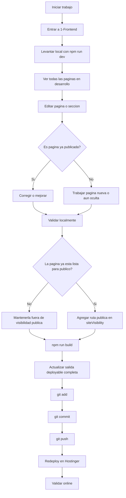
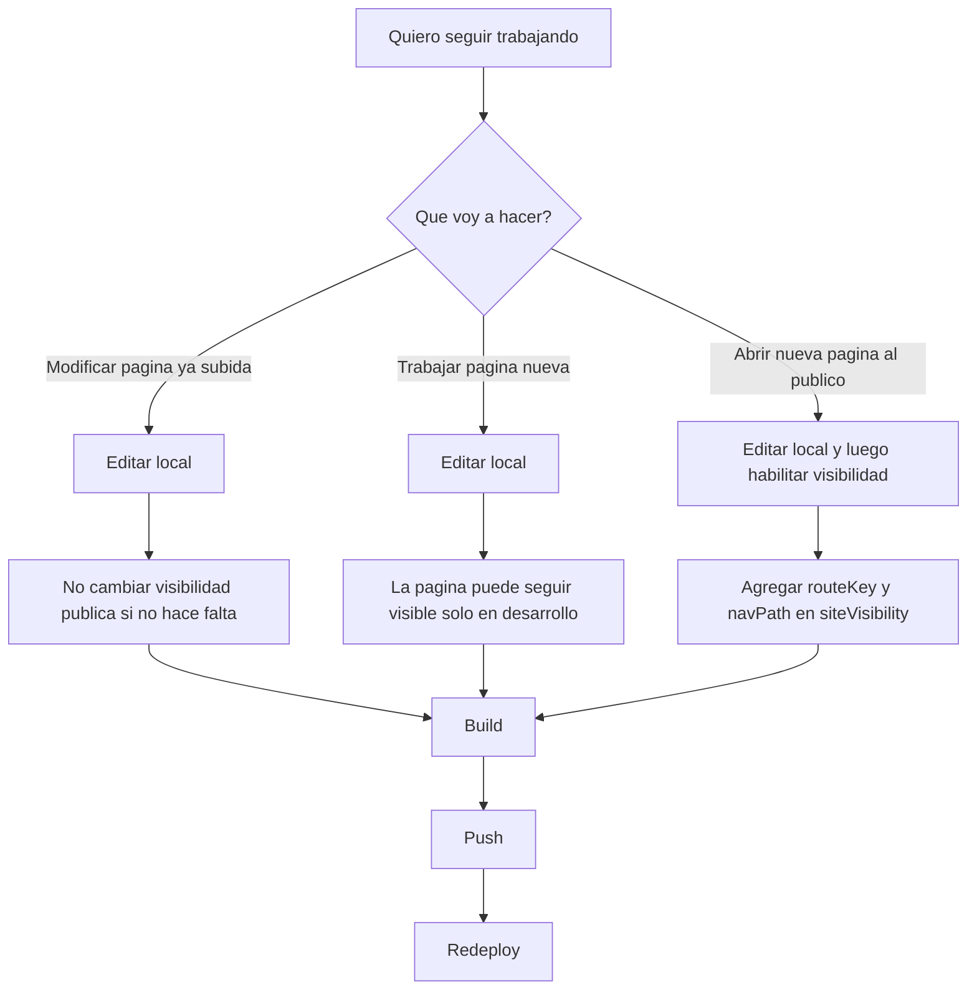
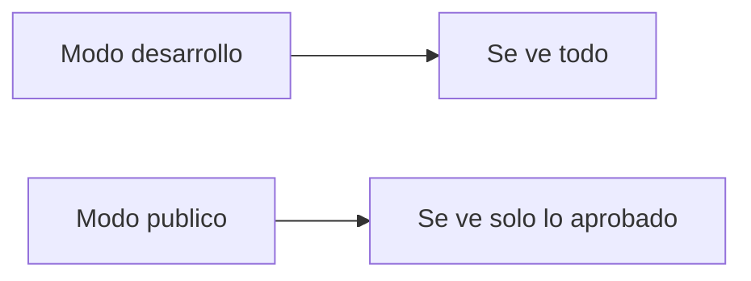

# Flujograma de Trabajo Qaway Web

## Objetivo

Este flujograma resume como trabajaremos desde ahora en:

- desarrollo local completo
- visibilidad publica controlada
- build
- GitHub
- Hostinger

## Flujo principal

## Bifurcacion real de trabajo

## Punto clave

## Donde se controla cada cosa

- Desarrollo completo local:
  - `npm run dev`
- Publicacion controlada:
  - `npm run build`
- Visibilidad publica:
  - `1-Frontend/src/config/siteVisibility.js`
- Router:
  - `1-Frontend/src/router/AppRouter.jsx`
- Navegacion:
  - `1-Frontend/src/components/layout/Navbar.jsx`
  - `1-Frontend/src/components/layout/Footer.jsx`
- Salida para Hostinger:
  - raiz de `1-Web-Qaway`

## Regla simple

1. En local vemos todo.
2. En publico solo sale lo aprobado.
3. Cuando una pagina este lista, la habilitamos.
4. Luego build, push y redeploy.

## Ejemplo practico

Caso:

- hoy trabajas `/sistemas-digitales`
- aun no esta lista

Entonces:

1. la ves en local sin problema
2. la editas
3. la pruebas
4. no la agregas todavia a visibilidad publica
5. haces build
6. push
7. si redeployas, seguira oculta al publico

Caso:

- `/sistemas-digitales` ya quedo lista

Entonces:

1. la agregas en `siteVisibility.js`
2. build
3. push
4. redeploy
5. ya queda visible online
