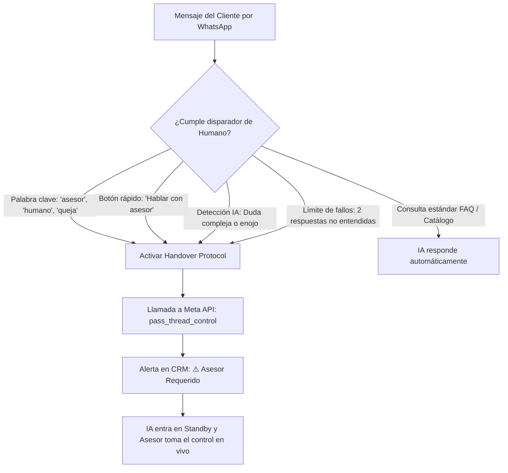
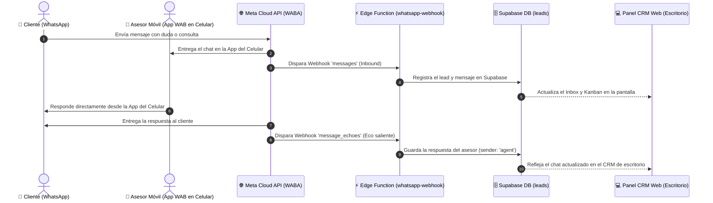
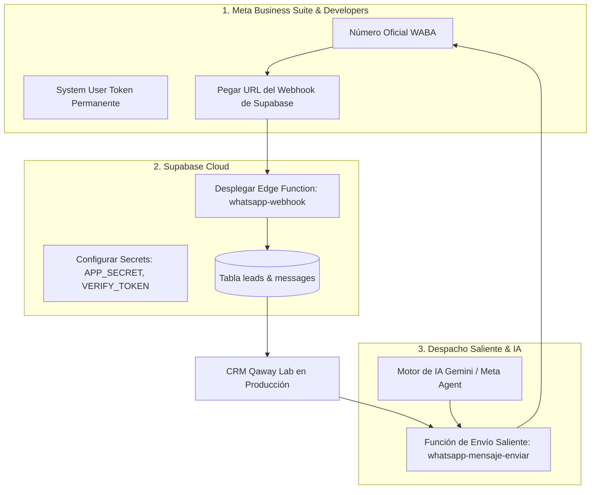
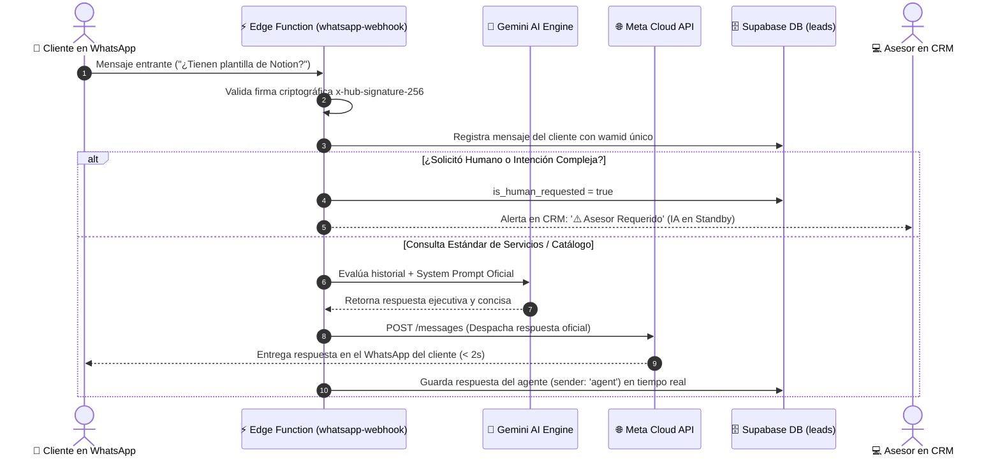
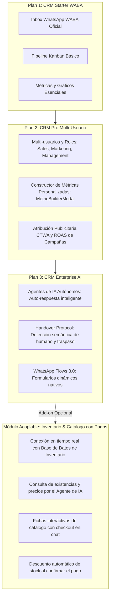
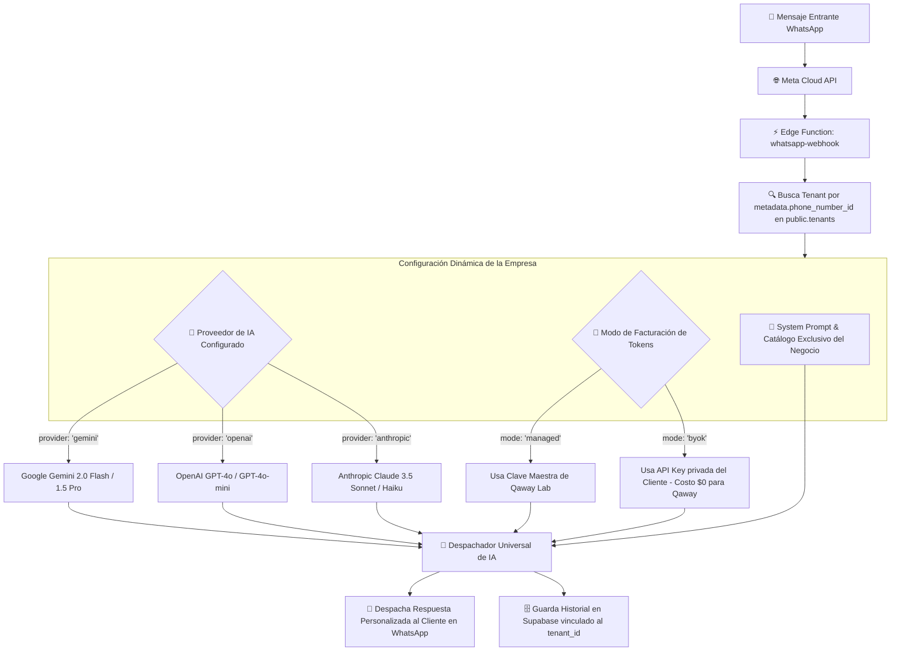

# Repositorio Oficial de Diagramas y Flujos del Sistema — 1-qawayLab-CRM

**Módulo:** 1-qawayLab-CRM  
**Ubicación:** `src/pages/5-qaway-hub/1-qawayLab-CRM/diagramas_flujos_arquitectura.md`  
**Última actualización:** 2026-09-17  

Este documento recopila de forma estructurada, con nombres y casos de uso, todos los diagramas arquitectónicos y de flujo creados para el ecosistema de comercio conversacional y CRM de Qaway Lab Digital.

---

## 📌 Flujo 01: Handover Protocol & Detección de Asesor Humano (Traspaso Inteligente)

### Propósito:
Garantizar que ningún cliente quede atrapado en un bucle con la IA. El sistema evalúa continuamente si la conversación debe ser atendida por un humano según 4 disparadores específicos.

### Casos de uso:
- Un prospecto solicita cotización corporativa personalizada.
- Un usuario escribe "quiero hablar con una persona".
- El cliente expresa inconformidad o duda técnica fuera del alcance del bot.

---

## 📌 Flujo 02: Coexistencia Híbrida App Móvil + Cloud API (Message Echoes)

### Propósito:
Permitir que el dueño del negocio o asesor responda con total comodidad desde la **aplicación móvil nativa de WhatsApp Business en su celular**, mientras el **CRM en la computadora** se mantiene 100% sincronizado en tiempo real sin perder datos ni chats.

### Casos de uso:
- El asesor está fuera de la oficina y responde desde la calle con su celular.
- El equipo en la oficina ve en el CRM todo lo que el asesor habló sin retrasos.

---

## 📌 Flujo 03: Ciclo de Vida de Mensajería Saliente & Despacho (WABA Outbound & IA)

### Propósito:
Visualizar el recorrido de un mensaje cuando se envía desde el panel del CRM hacia los servidores de Meta y al teléfono del cliente, controlando la ventana de 24 horas y el uso de plantillas HSM.

---

## 📌 Flujo 04: Secuencia de Auto-Respuesta Autónoma con Gemini 2.0 y Cloud API

### Propósito:
Explicar cómo la Edge Function `whatsapp-webhook` recibe el mensaje del prospecto, consulta a Gemini con el System Prompt oficial de Qaway Lab y despacha la respuesta al cliente en menos de 2 segundos.

---

## 📌 Flujo 05: Arquitectura SaaS Composable por Planes Modulares

### Propósito:
Representar cómo el CRM se comercializa y activa de forma desacoplada según el plan del cliente (Starter, Pro, Enterprise y Add-on de Inventario).

---

## 📌 Flujo 06: Arquitectura Multi-Tenant & Despachador Multi-Modelo Universal (BYOK)

### Propósito:
Permitir que el SaaS de Qaway Lab opere con múltiples clientes empresariales de forma aislada. Cada cliente puede usar el modelo que prefiera (Gemini, OpenAI, Claude) y elegir si utiliza la cuenta de Qaway Lab (Managed) o conecta su propia API Key corporativa (Bring Your Own Key - BYOK).

### Casos de uso:
- **Caso 1 (Qaway Lab):** Utiliza Gemini 2.0 Flash en modo *Managed* con el catálogo y portafolio digital de Qaway.
- **Caso 2 (CoraVet Veterinaria):** Utiliza Gemini 2.0 Flash en modo *Managed*, con el agente "Luna", protocolo de urgencias veterinarias y agenda médica.
- **Caso 3 (Vallet Inmobiliaria - BYOK):** Utiliza GPT-4o con su propia API Key de OpenAI, filtrando clientes por presupuesto y zona sin costo de tokens para Qaway.

