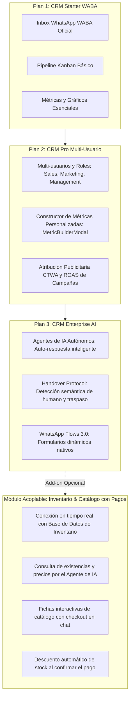

# Registro de Avance: Creación, Implementación y Mejoras - 1-qawayLab-CRM

**Módulo:** 1-qawayLab-CRM  
**Ubicación:** `src/pages/5-qaway-hub/1-qawayLab-CRM/`  
**Ruta de acceso en navegador:** `/hub/crm`  
**Fecha de inicio:** 2026-09-16  

---

## 1. Contexto y Propósito del Módulo
El módulo **1-qawayLab-CRM** es la solución centralizada de gestión de relaciones comerciales, embudo de ventas y comercio conversacional (WhatsApp) de Qaway Lab Digital.

### Componentes Actuales:
- `CRMPage.jsx`: Contenedor principal con pestañas y roles (`management`, `marketing`, `sales`), protegido por un `ErrorBoundary` SaaS corporativo y simulador de webhooks CTWA.
- `context/CRMContext.jsx`: Estado global desacoplado y conectado al adaptador, con evaluación de ventana de 24h y soporte para payloads de Flows y Catálogo.
- `types.js`: Contratos canónicos de datos (Leads, Campañas, Mensajes con `wamid`, Atribución `referral`, Ventana 24h WABA).
- `adapters/crmAdapter.js`: Capa de abstracción de datos para Supabase y Webhooks de Meta.
- `components/`:
  - `DashboardView.jsx`: KPIs y analítica comercial.
  - `KanbanView.jsx`: Pipeline comercial con Drawer lateral interactivo.
  - `WhatsAppInboxView.jsx`: Inbox de comercio conversacional de 3 paneles resizables, con soporte nativo de WhatsApp Flows 3.0, Catálogo con Pagos, ventana de 24h y atribución CTWA.
  - `CampaignsView.jsx`: Reportes y atribución de campañas con métrica de ROAS y datos de demostración si la base de datos está vacía.
  - `LeadsView.jsx`, `ClientesView.jsx`, `TareasView.jsx`, `AutomatizacionesView.jsx`, `ConfiguracionView.jsx`.
  - `MetricBuilderModal.jsx`: Creador de métricas.
- `meta_ai_consultoria_waba.md`: Repositorio de requerimientos y auditoría de la IA de Meta (WABA Septiembre 2026).

---

## 2. Registro de Iteraciones y Mejoras

### [Iteración 01 - 2026-09-16]
- Renombrado de carpeta de `crm/` a `1-qawayLab-CRM/` en `src/pages/5-qaway-hub/`.
- Actualización de importación diferida en `src/router/AppRouter.jsx`.
- Creación de bitácora (`creacion_app_implementacion.md`) y repositorio de Meta (`meta_ai_consultoria_waba.md`).

### [Iteración 02 - 2026-09-16]
- **Fase 1 (Arquitectura & Tipado):** Creación de `types.js`, `adapters/crmAdapter.js` y desacoplamiento de Supabase de `CRMContext.jsx`.

### [Iteración 03 - 2026-09-16]
- **Fase 2 (Resiliencia y Fallback):** Rediseño del `ErrorBoundary` con fallback SaaS corporativo `#111111` y auditoría de consistencia global.

### [Iteración 04 - 2026-09-16]
- **Fase 3 (Atribución CTWA y Regla de 24h):** Candado en el inbox si pasan >24h sin respuesta del cliente, badge de estado en tiempo real, bloque CTWA en ficha del lead y cálculo de ROAS en campañas.

### [Iteración 05 - 2026-09-16]
- **Fase 4 (Comercio Conversacional - WABA Septiembre 2026):**
  - **WhatsApp Flows 3.0 Integrados:** Envío y renderizado de formularios interactivos dentro de WhatsApp (`Formulario Cotización`, `Agendar Cita`).
  - **Catálogo Oficial y Pagos Nativos:** Envío de fichas de producto (`Plantilla Notion Pro`, `Curso Identidad Visual`) con precios y botón de checkout interactivo simulando WhatsApp Pay.
  - **Selector de Acciones Rápidas:** Sub-pestañas ergonómicas en la barra de entrada (`✨ Plantillas HSM` | `📋 WhatsApp Flows` | `🛒 Catálogo & Pagos`).

### [Iteración 06 - 2026-09-16]
- **Ajustes de Visibilidad y Simulación en Vivo:**
  - **Gestor de Campañas sin Pantalla en Blanco:** Inclusión de `DEMO_CAMPAIGNS` como fallback en [CampaignsView.jsx] cuando la tabla de Supabase está vacía, desplegando tarjetas de anuncios con ROAS de 4.38x y 4.24x.
  - **Simulador CTWA de Meta Ads:** Actualización de `handleSimulate` en [CRMPage.jsx] para inyectar leads completos con nombre, WhatsApp y objeto `referral` de Meta Ads, permitiendo ver la tarjeta de atribución verde y la insignia "72h Gratis".
  - **Claridad de Sub-Pestañas:** Rediseño prominente de los selectores de Plantillas, Flows y Catálogo con badges de conteo y subtítulos descriptivos en [WhatsAppInboxView.jsx].

### [Iteración 07 - 2026-09-16]
- **Registro de Activos Oficiales y Arquitectura de Integración WABA (Ronda 02 de Meta):**
  - **Credenciales del Business Manager:** Registro del Business ID (`860625207070053`) y Asset ID (`1065820593280322`) vinculados a Qaway Lab.
  - **Aprovisionamiento de Meta Business Agent:** Requisitos de System User Admin con permisos `whatsapp_business_messaging` y `whatsapp_business_management`.
  - **Handover Protocol (Human Handoff):** Definición de arquitectura Primary Receiver en CRM y transferencia fluida mediante `pass_thread_control` para alternar entre IA y asesores.
  - **Seguridad en Webhooks:** Especificación de validación criptográfica `x-hub-signature-256` con HMAC-SHA256 y deduplicación con `wamid`.
  - **Atribución CTWA:** Mapeo del objeto `referral` (`source_id`, `headline`, `image_url`) con la campaña activa y ventana de 72 horas gratuitas.
  - **WhatsApp Flows 3.0:** Requerimientos de cifrado RSA y esquemas de intercambio de datos dinámicos.

### [Iteración 08 - 2026-09-17]
- **Blindaje de Webhooks, Handover Protocol & Soporte Omnicanal en Producción:**
  - **Edge Function `webhook-whatsapp`:** Implementación de validación criptográfica `x-hub-signature-256` con HMAC-SHA256 y `APP_SECRET` usando Web Crypto API de Deno.
  - **Detección de Human Handoff:** Algoritmo de detección de disparadores semánticos (`HUMAN_INTENT_KEYWORDS`) en la Edge Function para transferir automáticamente el control de la conversación de la IA al asesor (`is_human_requested: true`).
  - **Extracción de Atribución CTWA:** Almacenamiento estructurado del objeto `referral` en Supabase con fecha de expiración de ventana gratuita de 72 horas (`ctwa_expires_at`).
  - **Idempotencia Anti-Duplicados:** Registro de `wamid` y descarte automático de eventos duplicados reenviados por la Cloud API de Meta.
  - **Alertas Visuales en el CRM:** Incorporación de insignias interactivas `⚠️ Asesor Requerido` en la lista de chats y en la cabecera del chat activo de [WhatsAppInboxView.jsx].
  - **Simulación Enriquecida:** Nuevo caso de prueba en [CRMPage.jsx] y [CRMContext.jsx] con solicitud explícita de asesor humano para comprobar el flujo en vivo.

### [Iteración 09 - 2026-09-17]
- **Uniformización de Nomenclatura y Despacho Saliente (Meta Cloud API):**
  - **Uniformización de Edge Functions:** Creación de `whatsapp-webhook` como gemelo uniforme y estandarizado de `webhook-whatsapp`, permitiendo convención uniforme con prefijo de módulo.
  - **Edge Function Saliente `whatsapp-mensaje-enviar`:** Creación del endpoint de despacho saliente hacia la Meta Graph API v20.0 con soporte para mensajes de texto y plantillas HSM oficiales, actualización reactiva del historial del lead en Supabase y modo simulación seguro cuando los secrets no están cargados.
  - **Conexión en CRM Adaptador y Contexto:** Incorporación de `crmAdapter.sendWhatsAppMessage` y llamado automático dentro de `sendMessage` en [CRMContext.jsx], logrando que el botón "Enviar" despache hacia WhatsApp en producción.

### [Iteración 10 - 2026-09-17]
- **Script de Migración SQL & Motor de Auto-Respuesta IA con System Prompt Oficial:**
  - **Migración SQL Oficial (`20260917140000_crm_waba_omnichannel.sql`):** Script SQL idempotente con creación/actualización de `public.leads` (canales omnicanal, campos de Handover a humano, atribución CTWA en `metadata`), tabla `public.campaigns` con ROAS e índices de alto rendimiento en WhatsApp y `metadata` GIN.
  - **Feature Flags en Tenants:** Actualización de `public.tenants` con soporte nativo para los planes modulares (`crm_plan: 'starter' | 'pro' | 'enterprise'`, `has_ai_agent`, `has_custom_metrics`, `has_waba_sync`).
  - **Cerebro del Agente IA en `whatsapp-webhook`:** Integración del **System Prompt oficial de Qaway Lab** (identidad, servicios, Notion Pro a S/ 49 / $15 USD, desarrollo web y reglas estrictas de negocio).
  - **Auto-Respuesta Autónoma:** La función `whatsapp-webhook` invoca la API de Gemini para responder de inmediato al WhatsApp del prospecto cuando no requiere atención humana, guardando la respuesta de la IA en Supabase en tiempo real.

### [Iteración 11 - 2026-09-17]
- **Repositorio Unificado de Diagramas y Coexistencia Híbrida WABA (Message Echoes):**
  - **Repositorio Oficial de Diagramas (`diagramas_flujos_arquitectura.md`):** Consolidación de 5 diagramas arquitectónicos maestros documentados con propósitos y casos de uso (Flujo 01: Handover Protocol a Humano, Flujo 02: Coexistencia App Móvil + Cloud API, Flujo 03: Ciclo Saliente WABA, Flujo 04: Secuencia de Auto-Respuesta IA y Flujo 05: Planes SaaS Composable).
  - **Consultoría Oficial Ronda 03 en `meta_ai_consultoria_waba.md`:** Registro de la política de Coexistencia (App móvil WhatsApp Business + Cloud API simultáneos), sincronización de respuestas con `message_echoes`, integración de Catálogo en Commerce Manager y estructura de ventana de 24h con precios.
  - **Ingestión de `message_echoes` en `whatsapp-webhook`:** Soporte nativo para eventos `change.value.message_echoes`. Cuando el asesor responde desde la aplicación móvil de su celular, el mensaje se almacena automáticamente en Supabase con `sender: 'agent'` para que el panel del CRM web lo visualice en tiempo real sin desfase.

---

## 3. Arquitectura Modular Desacoplable por Planes (SaaS Composable)

El CRM de Qaway Lab está diseñado como un **SaaS Modular de Componentes Desacoplados**, lo que permite comercializarlo o habilitarlo por capas o planes independientes según la necesidad del cliente:

### Principios de Desacoplamiento Técnico:
1. **Feature Flags por Tenant:** Cada cliente en Supabase cuenta con un flag de plan (`starter`, `pro`, `enterprise`) y módulos habilitados (`has_ai_agent`, `has_inventory`, `has_custom_metrics`).
2. **Activación de Vistas en Frontend:** Si el cliente tiene Plan 1, las herramientas de analítica avanzada o constructores de métricas se ocultan o bloquean; si adquiere el módulo de Inventario, la sub-pestaña `Catálogo & Pagos` se conecta directamente con su inventario real.
3. **Backend Independiente (Edge Functions):**
   - Si no tiene Plan de IA, `whatsapp-webhook` solo registra el mensaje para atención manual humana (Plan 1 y 2).
   - Si adquiere Plan con IA, `whatsapp-webhook` activa el cerebro LLM para auto-responder.
   - Si adquiere Inventario, la IA consulta las existencias en la tabla de productos antes de responder o despachar un enlace de pago.

---

## 4. Registro de Tareas Pendientes (Mantenimiento y Depuración)
- [ ] **Depuración de compatibilidad:** Eliminar la carpeta `supabase/functions/webhook-whatsapp/` una vez que la nueva función `whatsapp-webhook` sea validada y probada al 100% en producción con Meta Cloud API.

