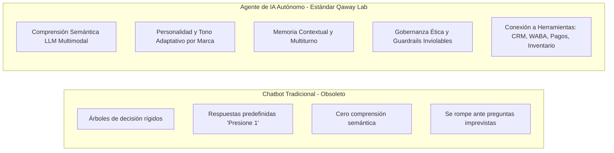
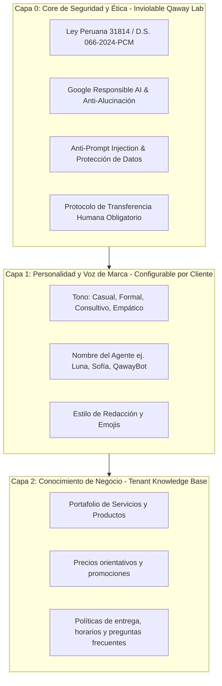

# Marco Maestro de Agentes de IA Responsable y Gobernanza Ética
**Qaway Lab Digital — Módulo Hub de Agentes Inteligentes**  
*Versión 1.0 — Septiembre 2026*  
*Ubicación oficial:* `src/pages/5-qaway-hub/2-Agentes/marco_maestro_agentes_ia_responsable.md`

---

## 1. Definición Conceptual: ¿Chatbot Tradicional vs Agente de IA Autónomo?

En Qaway Lab establecemos una distinción categórica para nuestra propuesta de valor:

- **Chatbot:** Sistema de reglas cerradas. Adecuado únicamente para menús numéricos simples.
- **Agente de IA Consultivo:** Entidad inteligente impulsada por modelos de frontera (Gemini 2.5 Flash, GPT-4o, Claude 3.5 Sonnet) capaz de dialogar, calificar prospectos, resolver objeciones y ejecutar acciones de negocio, manteniendo en todo momento los límites éticos y legales.

---

## 2. Marco Normativo Peruano: Valor Agregado y Cumplimiento Legal Obligatorio

Qaway Lab incorpora de manera transversal y pionera el marco normativo peruano en todas sus soluciones de software e inteligencia artificial. Esto constituye un **diferencial competitivo comercial** frente a soluciones informales del mercado.

### 2.1. Ley Nº 31814 y D.S. Nº 066-2024-PCM
- **Ley Nº 31814:** *Ley que promueve el uso de la inteligencia artificial en favor del desarrollo económico y social del país* (Promulgada por el Congreso de la República).
- **D.S. Nº 066-2024-PCM:** *Reglamento de la Ley Nº 31814* (Emitido por la Presidencia del Consejo de Ministros a través de la Secretaría de Gobierno y Transformación Digital - SGTD).

### 2.2. Principios Rectores Peruanos Implementados en Código:
1. **Principio de No Suplantación y Transparencia Activa:**
   - **Mandato:** Todo usuario debe ser informado explícitamente de que está interactuando con un sistema de inteligencia artificial. Está prohibido inducir al usuario al engaño haciéndole creer que habla con una persona humana real.
   - **Implementación en Qaway:** Cada inicio de sesión o presentación del agente declara su rol: *"Soy el Asistente Virtual Oficial..."*.
2. **Protocolo de Traspaso Humano (Human-in-the-loop):**
   - **Mandato:** La persona siempre tiene derecho a solicitar intervención humana y no quedar atrapada en un bucle automatizado.
   - **Implementación en Qaway:** Detección semántica de palabras clave (`humano`, `asesor`, `queja`, `reclamo`, `persona`) que activa de inmediato `is_human_requested: true` y congela la auto-respuesta del bot.
3. **Protección de Datos Personales (Ley Nº 29733):**
   - Prohibición estricta de solicitar números de tarjetas de crédito completas, contraseñas o datos biométricos en el chat.
   - Almacenamiento cifrado en Supabase con políticas RLS por empresa (aislamiento estricto de bases de datos entre clientes).

---

## 3. Marco de Responsabilidad de IA de Google (Google Responsible AI & PAIR Framework)

Qaway Lab adopta como estándar técnico de ingeniería los lineamientos de **Google Responsible AI Practices** y las guías del laboratorio **Google PAIR (People + AI Research)**:

### 3.1. Los 7 Principios de IA de Google aplicados en Qaway Lab:
1. **Ser socialmente beneficioso:** Respuestas orientadas a aportar claridad, educación y soluciones reales al cliente.
2. **Evitar crear o reforzar sesgos injustos:** El prompt del sistema neutraliza sesgos de género, edad, procedencia socioeconómica o nacionalidad en la atención al cliente.
3. **Diseñarse y probarse para ser seguros:** Mitigación de *Prompt Injection* (intentos del usuario de pedirle al bot que ignore sus instrucciones previas o revele claves).
4. **Rendir cuentas ante las personas (Accountability):** Registro auditable en Supabase de cada entrada, salida, latencia y proveedor utilizado.
5. **Incorporar privacidad desde el diseño (Privacy by Design):** Anonimización de datos de prueba y aislamiento Multi-Tenant.
6. **Mantener altos estándares de excelencia científica:** Uso de modelos calibrados con temperatura baja (0.2 - 0.3) para minimizar alucinaciones.
7. **Limitarse a usos autorizados:** Prohibido el asesoramiento médico invasivo no supervisado, legal vinculante o financiero de alto riesgo.

### 3.2. Directrices de Experiencia de Usuario (PAIR Guidebook):
- **Degradación Elegante (Graceful Degradation):** Cuando el agente no sabe la respuesta a una pregunta que no está en la base de datos de la empresa, **no inventa información**. Responde con honestidad: *"No cuento con ese dato exacto en este momento, pero puedo coordinar con nuestro equipo comercial para confirmártelo"*.
- **Explicabilidad y Confianza:** Respuestas breves, directas y con opción a llamada o contacto humano.

---

## 4. Arquitectura en Capas de Gobernanza (Multi-Tenant AI Engine)

Para permitir que cada cliente del Hub configure su propio agente sin romper las reglas de la empresa, la arquitectura opera en **3 Capas Jerárquicas**:

> **Regla de Oro de la Arquitectura:**  
> Ninguna instrucción de la Capa 1 o Capa 2 puede anular o contradecir las directivas de la Capa 0. La Capa 0 es inyectada programáticamente por el backend de Supabase antes del prompt de cualquier cliente.

---

## 5. Módulo Hub: Creador de Agentes (`src/pages/5-qaway-hub/2-Agentes`)

El nuevo módulo de la plataforma web permitirá a los clientes de Qaway Lab diseñar su agente en un asistente guiado de 4 pasos:

1. **Paso 1 — Identidad y Misión:**
   - Nombre del agente, empresa y sector (Salud, Inmobiliaria, E-commerce, Servicios).
   - Rol principal (Ventas, Soporte, Agendamiento, Calificación de Leads).
2. **Paso 2 — Personalidad y Tono (Capa 1):**
   - Selector ergonómico de tono (Formal Ejecutivo, Cercano & Empático, Dinámico & Juvenil).
   - Calibración de extensión de mensajes (WhatsApp-First: máximo 3 párrafos cortos).
3. **Paso 3 — Base de Conocimiento y Políticas (Capa 2):**
   - Editor de preguntas frecuentes, catálogo y límites de precios.
   - Definición de palabras clave de traspaso a humanos.
4. **Paso 4 — Simulador en Vivo (Playground con Auditor de Ética):**
   - Chat interactivo para probar al agente en tiempo real.
   - Semáforo de cumplimiento normativo (Ley 31814 + Responsible AI Check).
   - Despliegue con un clic a WhatsApp Cloud API (WABA) o Widget Web.

---

## 6. Hoja de Ruta para el Próximo Agente Especializado

Para el desarrollo del entrenamiento en el nuevo chat:
- **Rol del Agente:** *Architect & Prompt Engineer de Agentes de IA Responsable*.
- **Documentos de Entrada:** Este archivo maestro (`marco_maestro_agentes_ia_responsable.md`) y el backend desplegado en `supabase/functions/whatsapp-webhook/`.
- **Misión Inmediata:** Construir la interfaz de usuario en `src/pages/5-qaway-hub/2-Agentes/` y el motor de generación de prompts estructurados conforme a la Ley 31814 y Google Responsible AI.
