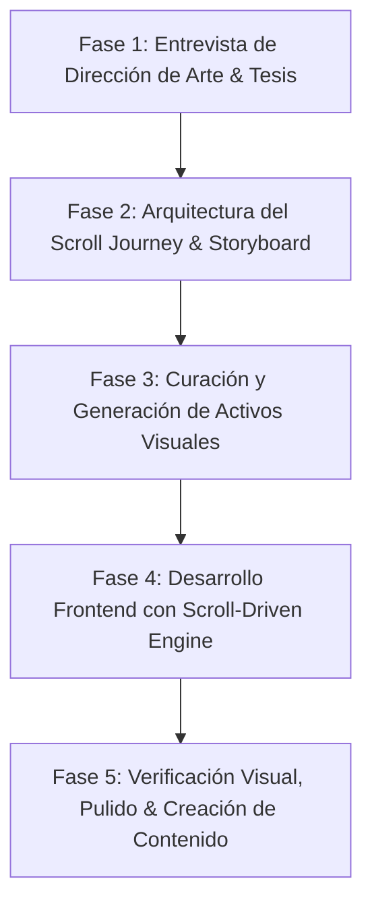

# Bitácora & Flujo: ScrollCraft (Webs Interactivas Guiadas por Scroll)
> **Proyecto:** Creador de Contenido - Qaway Lab  
> **Objetivo:** Diseñar y construir un flujo de desarrollo frontend de alto impacto visual basado en storytelling y scroll interactivo, documentando el proceso para convertirlo en un Caso de Estudio / Blog / Video.

---

## 🎯 1. La Tesis Central (Para el Blog / Video)
* **El Problema:** El 95% de las webs generadas con IA parecen plantillas genéricas ("AI Slop"), sin alma, con bloques repetitivos de texto y animaciones que se reproducen solas sin enganchar al visitante.
* **La Solución (ScrollCraft):** Convertir la web en una experiencia editorial inmersiva donde el visitante tiene el control. Cada movimiento de scroll revela una historia, conecta métricas, desbloquea datos ("receipts") y transforma la lectura en un viaje interactivo.
* **El Gancho (Hook del video):** *"Cómo pasé de webs aburridas de IA a landing pages interactivas estilo Apple o revistas editoriales usando un flujo de diseño por scroll guiado por agentes."*

---

## 🧭 2. Las 5 Fases del Flujo de Trabajo

### Fase 1: Entrevista de Dirección de Arte & Tesis
No se escribe código sin definir:
1. **La Promesa Principal (Tesis):** ¿Qué debe creer el visitante al llegar al final en una sola frase?
2. **El Vibe Visual:** (Ej. Editorial elegante, Cyberpunk técnico, Minimalismo limpio, Corporativo confiable).
3. **El Ritmo Emocional:** ¿Dónde el diseño debe sentirse calmado (espacios en blanco, lectura) y dónde intenso (datos rápidos, animaciones, contraste oscuro)?
4. **La Jugada Maestra (Signature Move):** Ese efecto único que nadie más tiene (ej. un contador de evidencias verificadas, tarjetas estilo pase de abordar que rotan con el ratón, zoom de producto 3D).

### Fase 2: El Scroll Journey (Storyboard)
Definición precisa de las estaciones del recorrido:
* **Hero / Apertura:** El hook visual que detiene el rebote inmediato.
* **Evidencias & Pruebas ("Receipts"):** Números reales, contadores animados o testimonios sincronizados.
* **El Problema vs. La Transformación:** Transición de luz/oscuridad o revelación horizontal.
* **La Oferta / Producto:** Foco en un elemento a la vez guiado por el usuario.
* **Llamado a la Acción (CTA) Final:** Conclusión natural del viaje.

### Fase 3: Stack Tecnológico
* **Core:** HTML5 / React + Vite / Tailwind CSS
* **Motor de Animaciones por Scroll:** GSAP + ScrollTrigger / Lenis Smooth Scroll
* **Elementos Visuales:** SVG dinámico, Canvas interactivo o assets curados/generados.

### Fase 4: Implementación & Refinamiento
* Despliegue en servidor local de desarrollo.
* Ajuste de velocidades (para evitar que las animaciones pasen demasiado rápido o distraigan).
* Verificación responsive (móvil y escritorio).

### Fase 5: Empaquetado como Contenido
* Grabación de pantalla del antes y después.
* Extracción de lecciones clave y prompts usados.
* Publicación en formato de Blog (Markdown) y Guión de Video (con marcas de tiempo y ganchos de retención).

---

## 📝 3. Registro de Avance en Vivo (Log de Sesión)

* **Paso 1 (Completado):** Estructuración del framework y metodología ScrollCraft.
* **Paso 2 (Definido):** **Proyecto: Módulo SaaS para el Panel de Qaway Lab.**
  * **Ubicación/Contexto:** Creador de Contenido / Panel Qaway Lab Digital.
  * **Objetivo:** Crear una interfaz interactiva de alto impacto para presentar y operar el nuevo módulo SaaS, combinando narrativa de producto, demostración en vivo e interactividad guiada por scroll.
  * **Siguiente paso:** Definir la funcionalidad específica del módulo SaaS y su recorrido interactivo (Scroll Journey).

---

## 🚀 4. Especificación del SaaS: Módulo Qaway Lab

### 4.1 Identidad del Módulo
* **Nombre sugerido:** `Qaway Content Engine` / `Qaway Creator Suite` (Módulo SaaS inteligente de creación, curación y orquestación de contenidos con IA).
* **Propuesta de valor:** Automatizar la generación de contenidos estratégicos para marcas (posts, carruseles, guiones y videos) con validación de métricas en tiempo real y flujos guiados.
* **Integración:** Diseñado con arquitectura modular para acoplarse directamente al panel central de Qaway Lab una vez validado.
